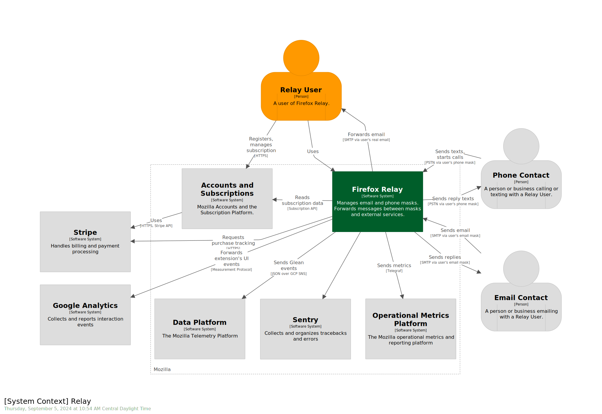
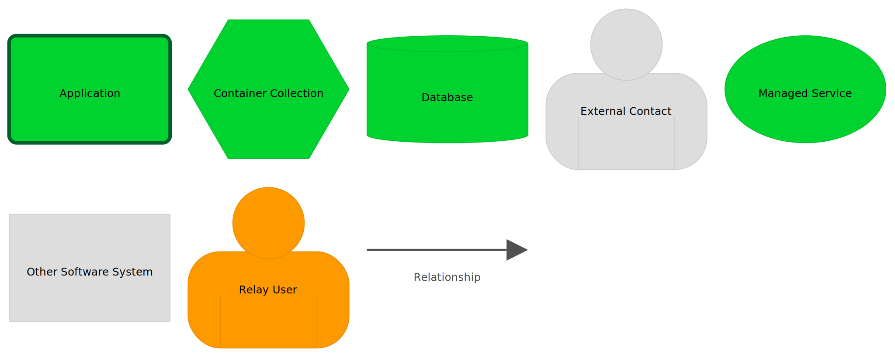
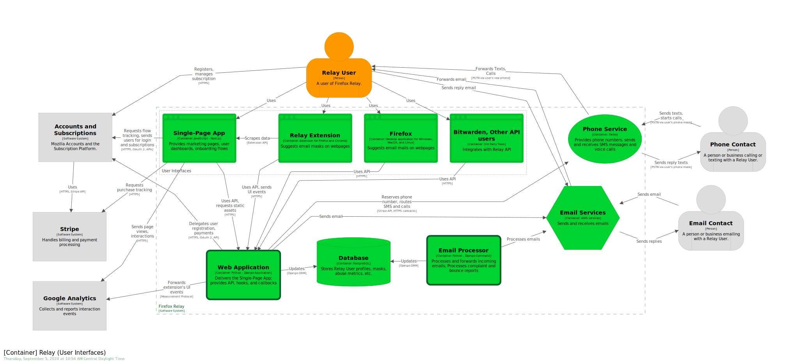
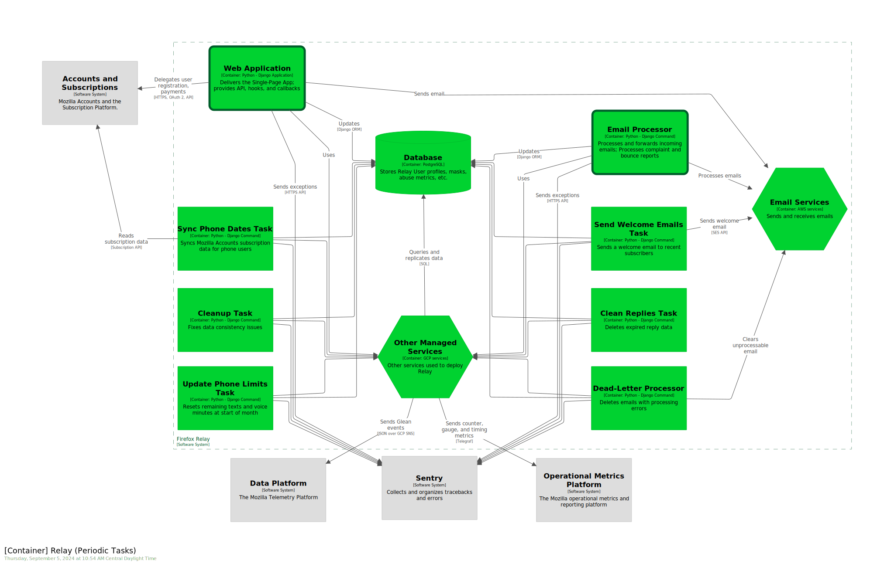
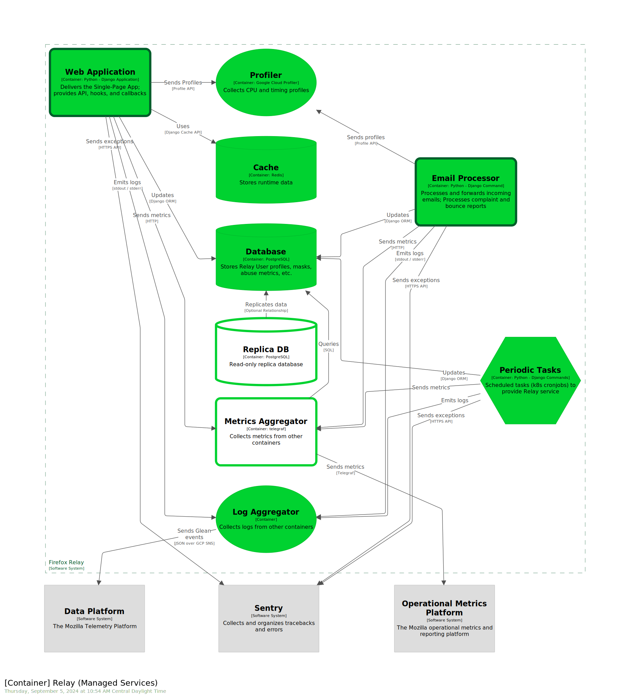
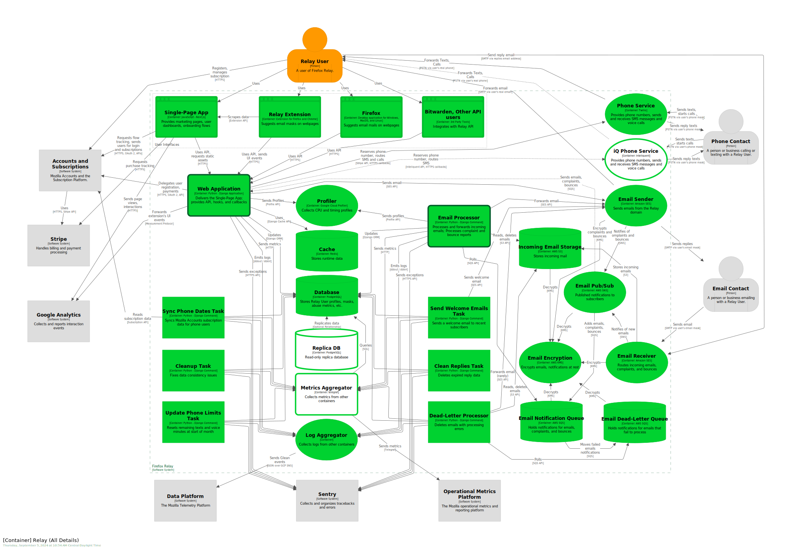
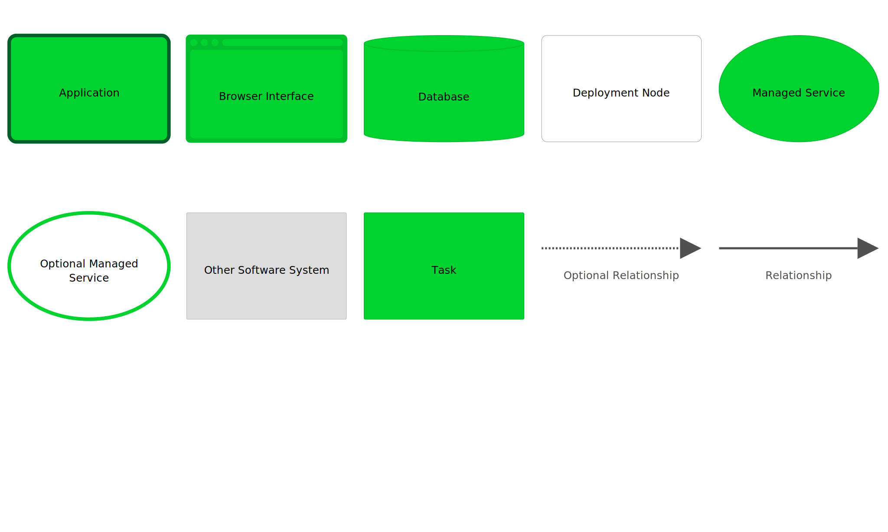

<!-- vim: set textwidth=88 ft=markdown syntax=markdown -->

# System Diagrams

This folder contains system diagrams for Relay, as well as the source model and
scripts to generate the diagrams.

The model currently includes the top two levels of the [C4 Model][]: System
Context and Containers.

## System Context Diagram

This shows the relationships between the Relay software system, other software systems,
and users:

Key:

## Containers Diagram

This shows all the relationships between the containers (independently deployed
parts) of Relay and the other software systems. Some containers have been grouped into
container collections, which are explored in more detail below.

- **Web Application** - A monolithic Python / Django application that provides an API
  and various other features.
- **Email Processor** - A backend Django application that handles emails, bounces,
  and complaints from the Email Services.
- **Database** - A PostgreSQL database, used by other components
- **User Interfaces** (_Collection_) - The various ways Relay users manage masks
- **Email Services** (_Collection_) - The AWS systems that provide email sending and
  receiving.
- **Other Managed Services** (_Collection_) - Other GCP services used to provide the
  Relay application and talk to Mozilla backend systems
- **Periodic Tasks** (_Collection_) - Other backend Django applications that help provide the service

Key:

### Container Diagram: Focus on User Interfaces

Relay users have a variety of interfaces for viewing and updating their Relay account:

- The single-page app (<http://relay.firefox.com> for production), which acts as a
  landing page to sell the services and as a dashboard to manage masks.
- The Firefox extension, which will detect and fill-in email masks
- Firefox, which integrates Relay into the form filling functionality
- Bitwarden and (unknown) API users, who also use the API to manage masks

All of these interfaces talk to the API endpoints in the Web Application. Relay users
also interact with the email and phone services, when they receive and reply to email,
SMS messages, and voice calls.

Key:

### Container Diagram: Focus on Periodic Tasks

The Relay service includes some background tasks that keep the service running without
slowing down API requests. These are scheduled (with cronjob) to run periodically:

- **Sync Phone Dates Task** - Checks phone subscription data, detects cancellations or
  term changes
- **Cleanup Task** - Performs a variety of data validation and cleanup jobs
- **Update Phone Limits Task** - Resets text and voice minutes at renewal date
- **Send welcome emails Task** - Send welcome emails to new Relay users
- **Clean Replies Task** - Deletes expired data needed to reply to a forwarded email
- **Dead-Letter Processor** - Deletes emails that are unable to be forwarded due to
  encoding or other processing errors

Key:

### Container Diagram: Focus on Email Processing

Relay uses several AWS services to implement email forwarding:

- **Email Sender** - Sends emails, and collects bounces and complaints
- **Email Receiver** - Receives emails for the Relay domains
- **Email Encryption** - Stores keys for encryption-at-rest, decrypts data for
  authorized callers
- **Incoming Email Storage** - Stores the bodies of received emails
- **Email Pub/Sub** - Forwards notification of new emails, bounces, and complaints
- **Email Notification Queue** - Stores notifications of new emails, bounces, and
  complaints. Hides notification that were recently read, to avoid double-processing.
  Moves notifications to the dead-letter queue after they are read three times.
- **Email Dead-Letter Queue** - Stores notifications of new emails that could not
  be processed after 3 attempts.

Key:

### Container Diagram: Focus on Other Managed Services

Relay uses several GCP-hosted services besides the PostgreSQL database:

- **Profiler** - Accepts timing profiles of execution runs. Used to determine what
  sections of code are slow.
- **Cache** - Stores runtime data for the web application
- **Replica DB** - A read-only replica, being tested in some deployments as a way to
  reduce load on the primary database.
- **Metrics Aggregator** - Collects statsd-style counter, gauge, and timer metrics from
  Relay applications and tasks, as well a query the database for some aggregated user
  statistics.
- **Log Aggregator** - Collects and combines logs from Relay applications, tasks, and
  other GCP services.

Key:

### Container, All Details

Here are all the Relay containers in a single diagram, with no container collections. It adds a few optional
containers:

- **iQ Phone Service** - An alternative phone provider tested in some deployments

Key:

# Dynamic Diagrams

Dynamic Diagrams show how data and actions move between components.

## Forwarding an Email to a Relay User

This diagram shows the "happy path" of an incoming email being forwarded to a Relay user.

Key:

# Deployment Diagrams

Deployment diagrams have the details of how containers are deployed, along with
additional services for the deployment environment.

## Development Deployment Diagram

The development deployment is hosted in Heroku and AWS. Deployments are done by Relay
developers, by pushing a branch to Heroku.

The Dev Deployment lacks some of the full Relay System features:

- Logs are not forwarded to the data platform
- Metrics are disabled
- Firefox does not integrate with this deployment
- There are no other API users (as far as we know)

The Dev Deployment has some additional features:

- The Inteliquent service is enabled as an alternate phone provider

Key:

## Stage Deployment Diagram

The stage deployment is hosted in GCP and AWS. Deployments are done by Jenkins
when a new tagged Docker image is published.

The Stage Deployment lacks some of the full Relay System features:

- Firefox does not integrate with this deployment
- There are no other API users (as far as we know)

The Stage Deployment has some additional features:

- There is a read-only replica of the database
- There is a canary app deployment. This single pod is updated first, so that any errors
  will halt the full deployment.
- The Metrics Aggregator (statsd-telegraf) queries the database periodically
- The stackdriver-telegraf service queries the GCP Cloud Metrics periodically

Key:

## Production Deployment Diagram

The production deployment is hosted in GCP and AWS. Deployments are done by Jenkins
when an SRE continues a stage deploy.

The Production Deployment has some additional features:

- There is a canary app deployment. This single pod is updated first, so that any errors
  will halt the full deployment.
- The Metrics Aggregator (statsd-telegraf) queries the database periodically
- The stackdriver-telegraf service queries the GCP Cloud Metrics periodically
- There is a read-only replica of the database
- There is a canary app deployment. This single pod is updated first, so that any errors
  will halt the full deployment.

Key:

# Tools: C4 and Structurizr

The Relay architecture is modelled using the [C4 Model][] for visualising
software architecture, created by [Simon Brown][]. The diagrams are generated
using [Structurizr][]. `workspace.dsl` is written in [Structurizr DSL][].
[Structurizr Lite][] is a dockerized web service for viewing and laying out the
diagrams. `workspace.json` has the details of the layout.

Mozilla Accounts is an early adopter of the C4 Model. See:

- [Ecosystem Platform: System Diagrams](https://mozilla.github.io/ecosystem-platform/reference/system-diagrams)
- [ecosystem-platform/architecture-diagrams](https://github.com/mozilla/ecosystem-platform/tree/master/architecture-diagrams)
- [fxa/docs/adr/0034-use-structurizr-diagrams.md](https://github.com/mozilla/fxa/blob/main/docs/adr/0034-use-structurizr-diagrams.md)

[C4 Model]: https://c4model.com/
[Simon Brown]: https://simonbrown.je/
[Structurizr]: https://structurizr.com/
[Structurizr DSL]: https://docs.structurizr.com/dsl
[Structurizr Lite]: https://docs.structurizr.com/lite

## Updating diagrams

The file `workspace.dsl` contains the model, written in [Structurizr DSL][]. The file
`workspace.json` contains the layout details.

To update the diagrams:

- Install [Docker][], such as Docker Desktop for Mac
- Run `./run_structurizr_lite.sh`
- Go to <http://127.0.0.1:8080/> in a browser
- Make changes to `workspace.dsl`. Refresh the page or use the "home" button to reload
  the model.
- Adjust the layout in the webapp
- (Optional) Fine-tune the layout in `workshop.json`
- Export the SVG images and move to the `img`, replacing existing images
- Check in `workshop.dsl`, `workshop.json`, and any changed images

[Docker]: https://www.docker.com/
